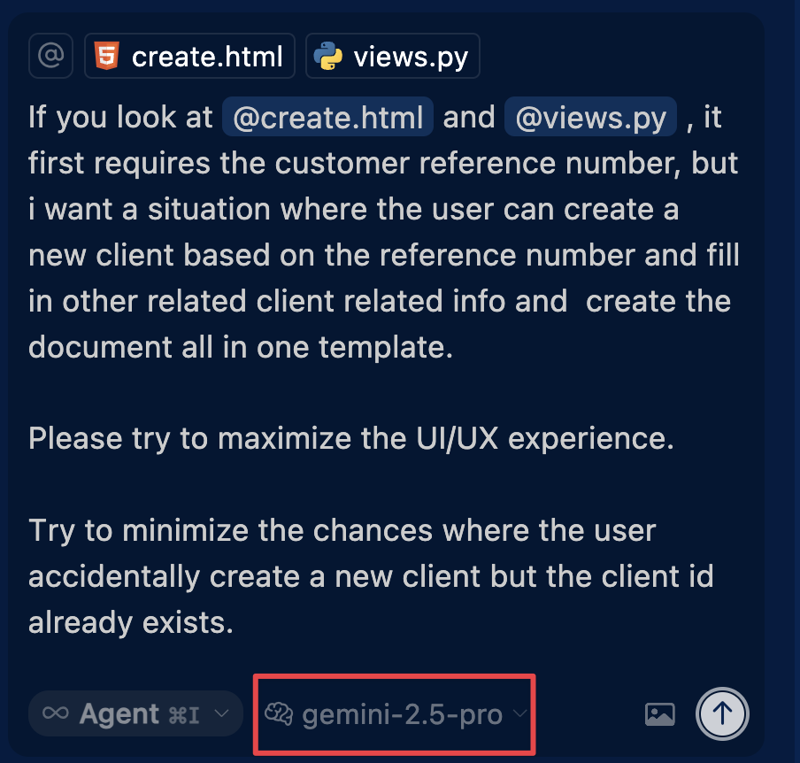

# Evaluating LLMs in Real-World Development: Beyond Traditional Benchmarks

## Introduction

This report presents an evaluation of Large Language Models (LLMs) in real-world software development scenarios, specifically focusing on their performance within AI-assisted IDEs. The study compares Claude 3.7 Sonnet and Gemini Pro 2.5 in implementing features for a law firm document management system using the Cursor IDE. The evaluation moves beyond traditional benchmark-focused approaches to assess practical utility in actual development workflows.

## Codebase Structure Overview

```
genai-eval-assignment/
│
├── django-generator/                # Tools for generating test Django projects
│   ├── generator.py                 # Main project generator script
│   ├── wrapper.py                   # Helper/wrapper utilities for generation
│   ├── requirements.txt             # Dependencies for the generator
│   ├── host_template/               # Template files for new Django projects
│   └── generated_projects/          # Output directory for generated projects
│       └── law_firm_docs_10lzj5/    # Example generated Django project (used in this evaluation)
│           ├── manage.py
│           ├── db.sqlite3
│           ├── law_firm_docs/       # Main Django app
│           └── ...                  # Other Django project files and folders
│
├── evaluation/                      # Evaluation framework and scripts
│   ├── step_01_run_tests.py         # Automated test runner
│   ├── step_02_check_python_code_quality.py # Python code quality checker
│   ├── step_03_check_template_quality.py    # Template quality checker
│   ├── run_evaluation.py            # Orchestrates the evaluation process
│   ├── llm_judge.py                 # LLM-as-judge explanation clarity scorer
│   ├── tasks/
│   │   └── task_definitions.json    # Human-readable task definitions and criteria
│   └── ...                         # Results, metrics, scripts, and documentation
│
├── presentation.html                # Slides for in-class presentation
├── framework.md                     # Detailed evaluation framework description
├── assignment.md                    # Assignment brief and planning notes
├── report.md                        # This report
├── cursor-looks-like.png            # Screenshot of Cursor IDE interface
└── ...                              # Other supporting files and documentation
```

### Key Components

- **django-generator/**: Automates the creation of realistic Django projects for LLM evaluation. Intended to support multiple projects for robust benchmarking.
- **generated_projects/**: Contains the actual Django projects generated for testing. For this study, only `law_firm_docs_10lzj5` was used.
- **evaluation/**: Houses all scripts, metrics, and definitions for evaluating LLM performance, including both automated and manual criteria.
- **task_definitions.json**: Defines the evaluation tasks, prompts, and scoring criteria in a structured, human-readable format.
- **presentation.html, framework.md, assignment.md, report.md, evaluation/results/law_firm_docs_10lzj5_20250520_1704.md**: Documentation and deliverables for the project.

## Methodology

### Task & Context

- Feature development in an existing Django codebase
- Testing conducted in Cursor IDE (real-world environment)
- Focus on contextual understanding and practical implementation
- Moving beyond i.i.d. (independent and identically distributed) assumptions


*Figure: Real-world development environment in Cursor IDE with Gemini Pro*

### Evaluation Framework

The framework incorporates both automated and manual metrics:

1. **Python Code Quality Delta (30%)**
   - Test coverage delta
   - Pylint score delta
   - New failed tests count
   - Measured through automated testing scripts

2. **Template Quality Delta (20%)**
   - Total issues delta
   - Categories: accessibility, inline styles, template tags, JavaScript, structure
   - Automated measurement through quality checks

3. **Number of Prompts (15%)**
   - Count of prompts needed to complete tasks
   - Lower scores indicate better efficiency

4. **Explanation Clarity (15%)**
   - LLM-as-judge evaluation (1-5 scale)
   - Automated but subjective assessment

5. **Task Efficiency (20%)**
   - Field efficiency ratio
   - Number of form submissions required

## Results

### Claude 3.7 Sonnet

- Python Quality: 0/10
- Template Quality: 8.4/10
- Prompt Efficiency: 9.5/10
- Explanation: 8/10
- Task Efficiency: 8/10
- **Final Score: 6.53/10**

### Gemini 2.5 Pro

- Python Quality: -2.54/10
- Template Quality: 8.8/10
- Prompt Efficiency: 9.5/10
- Explanation: 8/10
- Task Efficiency: 9/10
- **Final Score: 6.12/10**


The raw results are in `evaluation/results/law_firm_docs_10lzj5_20250520_1704.md`. `framework.md` details the calculation logic to convert the raw results into a single value score.

The calculation logic is replicated in the Appendix section under Calculation Logic.

## Lessons Learned

1. **Beyond Benchmarks**
   - Traditional benchmarks don't fully capture real-world utility
   - Contextual understanding is more important than isolated task completion
   - Real development scenarios require different evaluation approaches

2. **Practical Implementation**
   - Both models showed strengths in different areas
   - Template quality was consistently strong
   - Python code quality needs improvement

3. **Scoring System Flaws**
   - The current scoring system for Python code quality delta is flawed. For example, Sonnet had one failed unit test but Gemini, despite passing all tests, received a negative score for Python quality because adding more code or features can naturally decrease coverage or pylint delta. This penalizes models for making necessary changes and does not accurately reflect real progress. The evaluation framework needs improvement to better account for such scenarios.

4. **Future Directions**
   - Need for more sophisticated contextual understanding
   - Importance of maintaining code quality
   - Value of human-in-the-loop evaluation

## Conclusion

This evaluation demonstrates the importance of moving beyond traditional benchmark-focused approaches to LLM evaluation. By focusing on real-world development scenarios and practical implementation, we gain insights into how these models perform in actual development environments. The results show that while both models have strengths, there's significant room for improvement in certain areas, particularly in maintaining code quality while implementing new features.

## Appendix

References:

- Repository: <https://github.com/simkimsia/genai-eval-assignment>
- "The Second Half of AI" by Shunyu Yao (2025)
- Cursor IDE Documentation

## Calculation Logic

This part details how the raw results are calculated to return a single value score to score how the LLM performs within the task.

### 1. Python Code Quality Delta (30%)

- Measured by `step_01_run_tests.py` and `step_02_check_python_code_quality.py`
- Components:
  - Test coverage delta (after - before)
  - Number of new failed tests (after - before)
  - Pylint score delta (after - before)
- Scoring:
  - If any old tests fail: 0 points
  - If no new failures: (coverage_delta + pylint_delta) / 2
  - Example:
    - Before: 80% coverage, 8.0 pylint
    - After: 85% coverage, 8.5 pylint
    - Delta: +5% coverage, +0.5 pylint = 2.75 points

### 2. Template Code Quality Delta (20%)

- Measured by `step_03_check_template_quality.py`
- Components:
  - Total issues delta (after - before)
  - Categories: accessibility, inline styles, template tags, JavaScript, structure
- Scoring:
  - Formula: max(0, 10 - (issues_delta / 5))
  - Example:
    - Before: 30 issues
    - After: 40 issues
    - Delta: +10 issues = 8 points (10 - (10/5))

### 3. Number of Prompts (15%)

- Manual count of prompts needed to complete the task
- Lower is better
- Scoring:
  - Formula: max(0, 10 - (prompt_count / 2))
  - Example:
    - 4 prompts = 8 points
    - 10 prompts = 5 points
    - 20+ prompts = 0 points

### 4. LLM-as-Judge Explanation Clarity (15%)

- Automated evaluation of code explanation quality
- Scale: 1-5
- Scoring:
  - Formula: (score / 5) * 10
  - Example: 4/5 = 8 points

### 5. Task Completion Efficiency (20%)

- Measured by:
  - Field efficiency ratio (actual_fields / minimum_required_fields)
    - Closer to 1.0 is better
    - Example: 8 fields when only 6 are needed = 0.75
  - Number of form submissions needed
    - Lower is better
    - Example: 2 submissions = 8 points
- Scoring:
  - Field efficiency: min(10, field_ratio * 10)
    - Example: 0.75 ratio = 7.5 points
  - Form submissions: max(0, 10 - (submission_count * 2))
    - Example: 2 submissions = 6 points
  - Final score: average of the two
  - Example:
    - Field efficiency: 7.5 points
    - Form submissions: 6 points
    - Final: 6.75 points

## Project Generation and Task Definition

This covers how the test project is generated and can be extended to generate more test projects.

### Django Project Generator

To facilitate realistic and repeatable LLM evaluation, a custom tool called `django-generator` was developed. Its purpose is to programmatically generate Django projects with varying structures and requirements. The intention was to create multiple such test projects, each simulating a real-world codebase with both presentational (UI/UX) and business logic components. This would allow benchmarking LLMs across a diverse set of tasks, better reflecting the challenges of modifying existing codebases.

### Generated Projects

The `generated_projects` folder contains the output of the generator. While the original plan was to create several projects for broader benchmarking, due to time constraints, only one project—`law_firm_docs_10lzj5`—was fully created and used for this evaluation. This project served as the testbed for all LLM-driven development and evaluation activities described in this report.

### Task Definitions

The `evaluation/tasks/task_definitions.json` file defines the actual tasks in a human-readable, structured format. Each task includes:

- A description of the feature or change to be implemented
- The relevant project and files
- The prompt template used for LLM interaction
- Detailed evaluation criteria and metrics (both automated and manual)

This approach ensures clarity, repeatability, and transparency in how LLMs are evaluated on real development tasks.

## Possible Future Enhancements

- **Multiple Project Benchmarks:** Expand the generator and evaluation to cover several Django projects, increasing the diversity and robustness of LLM benchmarking.
- **Task Variety:** Define a broader set of tasks, including more complex UI/UX changes, API integrations, and refactoring challenges.
- **Automated Evaluation Pipeline:** Develop scripts to automate the full evaluation process, from project generation to metric calculation and report generation.
- **Longitudinal Studies:** Track LLM performance over time as models and tools evolve, providing insights into progress and persistent challenges.
- **Human-in-the-Loop Feedback:** Incorporate more nuanced human feedback, such as developer satisfaction and qualitative usability assessments, alongside quantitative metrics.
